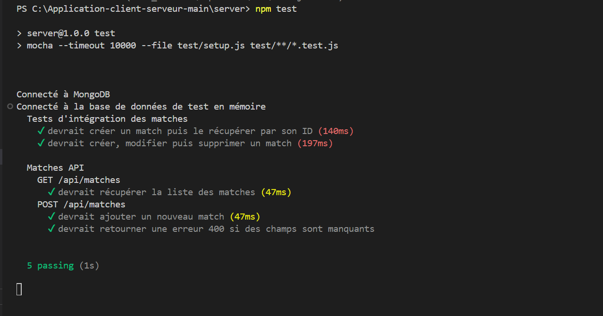
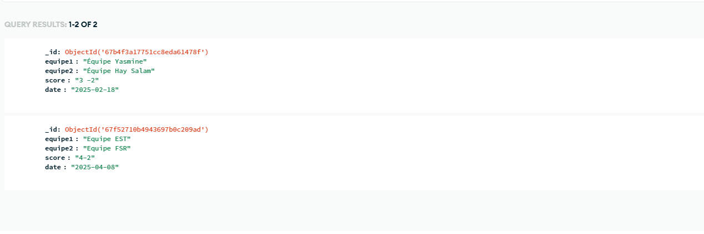
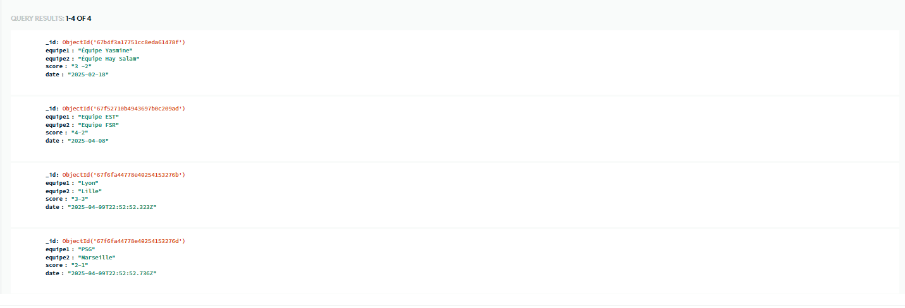

# Documentation de la procédure de test.

### Ce document décrit la procédure pour exécuter les tests de l'application de gestion des matchs.

J'ai utilisé Mocha comme framework de test, et Chai pour les assertions.

J’ai implémenté un test unitaire pour la route /api/matches (GET), qui retourne tous les matches, ainsi que j'ai tester l'ajout d'un match puis le récupérer.

# Prérequis

Node.js et npm installés

mongodb-memory-server 

Application backend et frontend installées

# Configuration

Assurez-vous que mongodb-memory-server est installé si n'est pas installé tape la commande: npm install --save-dev mongodb-memory-server
est disponible

tape npm install

# Tests unitaires et d'intégration
### Pour exécuter tous les tests :
cd server

npm test

Voici un aperçu des tests passés avec succès :

Ceci est la base de donnés avant le test

et quand je lancer le test les matche que j'ai ajouter dans le test sont ajouter dans la base de donné

